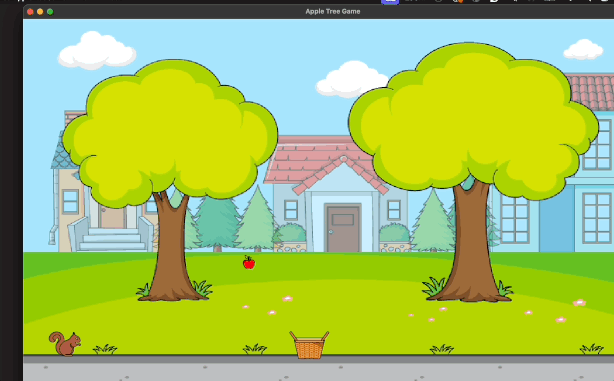

# Appletree Game

## Overview

Pair-programmed a project to create a simple game using C++ and the SFML library for its GUI components. We created several objects on screen (including one that was created dynamically), with some of them interacting with one another, and enabled user interaction through the keyboard.

The objective of the game is to catch falling apples from a tree in a basket, while a squirrel occasionally appears and tries to interfere. If the squirrel touches the basket, the game restarts. The user can thwart the squirrel by throwing an apple at it.

## Demo



### Gameplay:
- **A** (left) and **D** (right) keys control the movement of the basket.
- **SPACEBAR** throws an apple at the squirrel.

## Installation and Setup

### Prerequisites

- **CMake** (version 3.15 or higher)
- **SFML** (version 2.5)

Ensure you have CMake installed on your system. You can download it from the [CMake official website](https://cmake.org/download/).

For SFML installation, you can follow the instructions on the [SFML official website](https://www.sfml-dev.org/download.php).

### Building the Project

1. **Clone the repository:**

   ```sh
   git clone https://github.com/reshmar00/appleTreeGameSFML.git
   cd appletreeGame

2. **Create a build directory:**

   ```sh
    mkdir build
    cd build

3. **Run CMake to configure the build:**

   ```sh
    cmake ..

&nbsp;&nbsp;&nbsp; This command will generate the necessary build files in the `build` directory.

4. **Build the project:**

   ```sh
    make

&nbsp;&nbsp;&nbsp; This will compile the source files and link them into the final executable.

### Running the game

&nbsp;&nbsp;&nbsp; **After the build process completes successfully, you can run the game with the following command:**

  ```
  ./testappletreeGame
  ```

## Additional Information
### Project Structure


- **CMakeLists.txt:** CMake build configuration file.
- **src/:** Source directory containing .cpp and .hpp files for the game.
- **apple-new.png, squirrel-new.png, basket-new.png, background-new.png:** Image assets for the game.


### Copying Assets
The `CMakeLists.txt` file is configured to copy necessary image assets into the build directory, so you don't need to manually move them.


Feel free to reach out if you have any questions or need further assistance. Enjoy the game!
